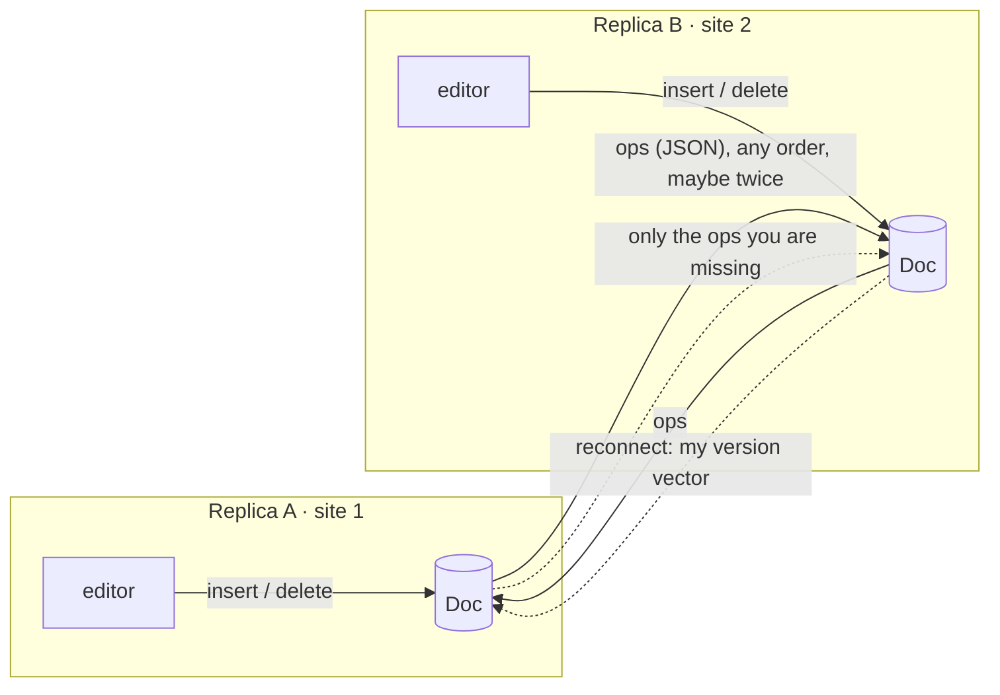

# kilim 🧶

[](https://github.com/ardazeybek-dev/kilim/actions/workflows/ci.yml)
[](https://crates.io/crates/kilim)
[](https://www.npmjs.com/package/@ardazeybek-dev/kilim)

**A small sequence CRDT for conflict-free collaborative text editing — written in Rust, running in the browser through WebAssembly.**

**▶ Live demo: https://ardazeybek-dev.github.io/kilim/**

Three simulated users type into the same document over a network you control: add latency, reorder messages, duplicate them, take a user offline. When the dust settles every replica holds exactly the same text. A second section syncs real browser tabs over `BroadcastChannel`.

*Kilim* is a flat-woven Turkish rug: many threads interleaved into one pattern.

## Why

Google Docs–style collaboration usually needs a central server that decides the order of edits. A **CRDT** (Conflict-free Replicated Data Type) removes that need: each replica edits locally, operations are exchanged in any order, and the math guarantees that replicas which have seen the same operations are identical. This is the idea behind *local-first* software (Figma multiplayer, Automerge, Yjs).

kilim implements **RGA** (Replicated Growable Array) in ~350 lines of Rust with no unsafe code, and ships it to JavaScript as a 130 KB WebAssembly module.

## How it works



| Idea | What it solves |
|---|---|
| Every character gets an id `(site, seq)` and an insert refers to its **left neighbour's id** (its *origin*), not an index | Indices shift under concurrent edits, ids don't |
| Concurrent inserts after the same origin are ordered by **`(lamport, site)`, newest first**; a skipped item's descendants always have a larger Lamport clock, so its whole subtree is skipped | Every replica computes the same position without talking to anyone |
| **Tombstones**: deleted characters stay in the sequence, hidden | A late insert can still attach to a neighbour that was deleted meanwhile |
| **Idempotent apply + dependency buffer** | Duplicated or out-of-order delivery is harmless |
| **Version vectors** (`site → ops seen`) | A replica coming back online receives only what it missed |
| **Cursor anchors** (id of the char left of the caret) | The local cursor stays put while remote edits shift the text |

## Use it

### JavaScript / TypeScript (npm)

```bash
npm install @ardazeybek-dev/kilim
```

```js
import init, { Doc } from "@ardazeybek-dev/kilim";
await init();

const alice = new Doc(1);          // site id: unique per replica
const bob = new Doc(2);

const ops = alice.insert(0, "merhaba");   // JSON string: send it anywhere
bob.applyRemote(ops);                      // order and duplicates don't matter
bob.text();                                // "merhaba"

// Wiring a <textarea>: diff the new value into ops
textarea.oninput = () => send(doc.applyText(textarea.value));

// Offline catch-up
const missing = alice.opsSince(bob.version());
```

Positions in the JS API are UTF-16 indices, the same as `String.prototype.slice`.

### Rust (crates.io)

```toml
[dependencies]
kilim = "0.1"
```

```rust
use kilim::Doc;

let mut a = Doc::new(1);
let mut b = Doc::new(2);
b.apply_all(a.insert(0, "hello"));

let from_a = a.insert(5, " world");
let from_b = b.insert(5, "!");
a.apply_all(from_b);
b.apply_all(from_a);
assert_eq!(a.text(), b.text());
```

## Develop

Rust does not need to be installed; the Docker image contains the toolchain.

```bash
docker build -t kilim-toolchain docker
docker run --rm -v "$PWD:/work" kilim-toolchain cargo test
docker run --rm -v "$PWD:/work" kilim-toolchain wasm-pack build --release --target web

# demo
cp pkg/kilim.js pkg/kilim_bg.wasm demo/pkg/   # mkdir -p demo/pkg first
python -m http.server 8765 --directory demo   # http://localhost:8765
```

With a local Rust toolchain: `cargo test` and `wasm-pack build --release --target web`.

### Tests

- Unit tests for concurrent inserts, delete/insert races, duplicate and reversed delivery, offline catch-up, cursor anchors and Unicode.
- **Randomised convergence test**: 300 seeds × 3 replicas × 60 random edits over a simulated network that delays, reorders and duplicates messages; all replicas must end up identical with nothing left in the dependency buffer.

## Project layout

```
src/
  op.rs      operation + id types, version vector
  doc.rs     the RGA document: integrate, buffer, sync, anchors
  wasm.rs    wasm-bindgen API (UTF-16 positions, JSON ops)
tests/       convergence tests
demo/        static demo page (deployed to GitHub Pages by CI)
docker/      reproducible Rust + wasm-pack toolchain
```

## Limitations

- Positions are resolved with a linear scan, fine for documents of tens of thousands of characters; a production CRDT would use a B-tree or run-length encoded items.
- Tombstones are never garbage-collected.
- Operations are JSON, one per character — simple to inspect, not compact.

## Pitfalls

- Windows without Visual Studio Build Tools → Rust cannot link native code → build inside `docker/` instead.
- `wasm-pack build` without `--target web` → package expects a bundler and fails when loaded directly by the browser → use `--target web` for the demo.

## License

MIT
